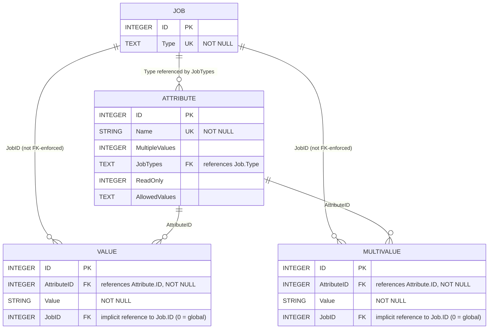

# Xondra.cfg — Entity Relationship Diagram

Generated by reading the SQLite `sqlite_master` schema directly from `Xondra.cfg`.

`Xondra.cfg` holds the application's job/attribute configuration model: a set of
`Job` types, `Attribute` definitions that can apply to those job types, and the
actual configured `Value` / `MultiValue` rows (single-value vs. multi-value
settings) tied to a specific job (or to `JobID = 0` for "global"/default
settings).

## Diagram

## Notes

- **Enforced foreign keys** (declared with `REFERENCES` in `CREATE TABLE`):
  `Value.AttributeID → Attribute.ID`, `MultiValue.AttributeID → Attribute.ID`,
  and `Attribute.JobTypes → Job.Type`.
- **Implicit relationships** (same naming convention, but not declared as a
  foreign key in the schema): `Value.JobID` and `MultiValue.JobID` line up
  with `Job.ID`; a value of `0` is used as a sentinel meaning "applies to all
  jobs" (see the `Settings_Json` view below, which special-cases `JobID <> 0`
  vs `JobID = 0`).
- `sqlite_sequence` is SQLite's internal autoincrement bookkeeping table and is
  omitted from the diagram.
- Unique indexes present: `Value` and `MultiValue` each have an
  auto-generated unique index on `ID` (from `PRIMARY KEY AUTOINCREMENT
  UNIQUE`), plus a non-unique index `ix_attributes_attributeid_value` on
  `Value (AttributeID, Value)`. `Job` is unique on `ID` and `Type`; `Attribute`
  is unique on `ID` and `Name`.

### Views built on top of this schema

Two SQL views compose the tables above into consumable shapes; they are not
separate storage/entities but are included here for context:

- **`JobAttributes`** — flattens `Value` and `MultiValue` into a single
  `(JobID, Attribute, AttributeID, Value, MultipleValues, ReadOnly)` result
  set by joining each against `Attribute`.
- **`Settings_Json`** — builds a per-`JobID` JSON object of
  `{AttributeName: value}` (merging job-specific values, global/default
  values where a job doesn't override them, and multi-value attributes as
  JSON arrays), producing one `BackupSettings` JSON blob per job.
