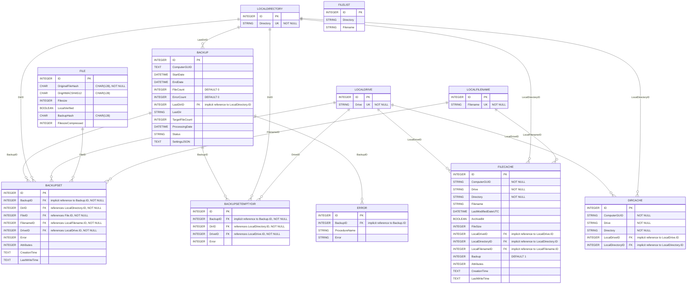

# Xondra.dat — Entity Relationship Diagram

Generated by reading the SQLite `sqlite_master` schema directly from `Xondra.dat`.

`Xondra.dat` holds the backup run history and the file/directory inventory
that supports it: `Backup` runs, the `BackupSet` (and `BackupSetEmptyDir`)
rows produced by each run, a dedupe-friendly `File` table keyed by content
hash, and normalized lookup tables (`LocalDrive`, `LocalDirectory`,
`LocalFilename`) that the caches (`FileCache`, `DirCache`) and backup sets
point into instead of repeating strings.

## Diagram

`FileList` has no columns that reference any other table and no relationships
were found to or from it — it appears to be a standalone/legacy table and is
shown unconnected in the diagram above.

## Notes

- **Enforced foreign keys** (declared with `REFERENCES` in `CREATE TABLE`):
  `BackupSet.DirID → LocalDirectory.ID`, `BackupSet.FileID → File.ID`,
  `BackupSet.FilenameID → LocalFilename.ID`, `BackupSet.DriveID →
  LocalDrive.ID`, `BackupSetEmptyDir.DirID → LocalDirectory.ID`,
  `BackupSetEmptyDir.DriveID → LocalDrive.ID`.
- **Implicit relationships** (matching naming convention/data, not declared
  as a foreign key in the schema): `BackupSet.BackupID`,
  `BackupSetEmptyDir.BackupID`, and `Error.BackupID` all point to
  `Backup.ID`; `Backup.LastDirID` points to `LocalDirectory.ID`;
  `FileCache.LocalDriveID` / `LocalDirectoryID` / `LocalFilenameID` and
  `DirCache.LocalDriveID` / `LocalDirectoryID` point to `LocalDrive.ID` /
  `LocalDirectory.ID`. `FileCache` also carries denormalized `Drive` /
  `Directory` / `Filename` text columns alongside the normalized ID columns.
- **Deduplication design**: `File` is keyed by `OriginalFileHash` (with a
  supporting index `ix_file_OriginalFileHash`) rather than by path, so
  identical file content backed up from multiple locations/times is expected
  to collapse to one `File` row, with many `BackupSet` rows pointing at it.
- `sqlite_sequence` is SQLite's internal autoincrement bookkeeping table and
  is omitted from the diagram.
- Additional index: `ix_backupset_all` on `BackupSet (BackupID, DirID,
  FileID, FilenameID, DriveID)`. `LocalDrive`, `LocalDirectory`, and
  `LocalFilename` each have a unique index on their text column
  (`Drive`/`Directory`/`Filename`) in addition to their `ID` primary key.
